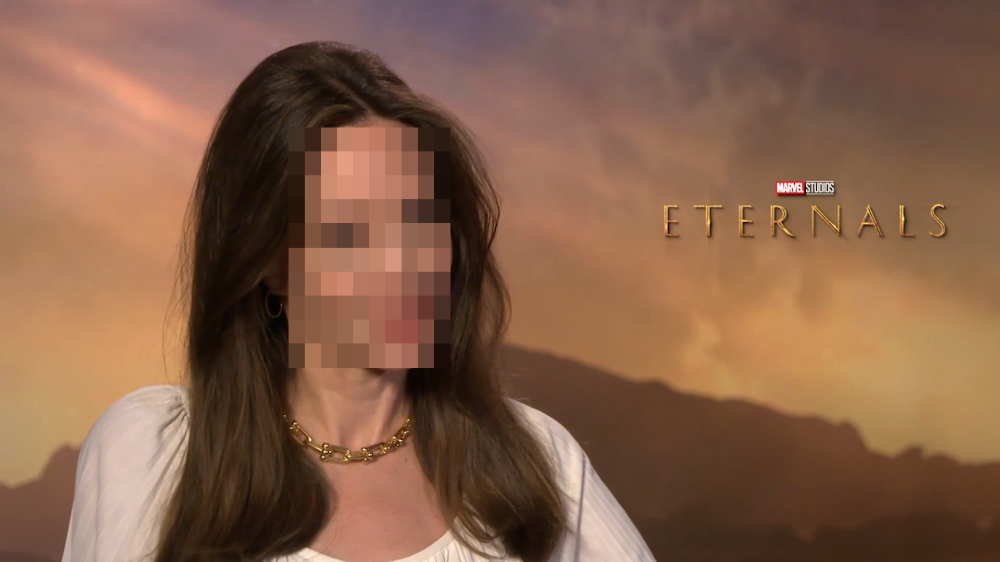

# pixelizer
“Pixelated blur” effect and anonymize faces with OpenCV, Python and ffmpeg

You can use this code for any image and video formats. For example, bmp, jpeg, png, mp4, avi etc.


To launch the project:
1. Creation of virtual environment
```
python3 -m venv /path/to/new/virtual/environment
```
```
source /path/to/new/virtual/environment/bin/activate
```
2. Installing packages using pip and virtual environment
```
pip install -r requirements.txt
```
3. Run the Python script in the active environment
```
python pixelizer.py angelina.png angelina_out.png
```

If you want to get an image from a video extract the first frame from the video using ffmpeg:
```
ffmpeg -i angelina.mp4 -ss 00:00:00 -vframes 1 angelina.png
```
before:

after:


